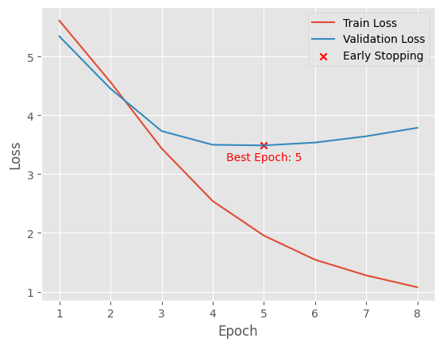

# Seq2Seq-NMT: Arabic to English Neural Machine Translation

This is a PyTorch implementation of a neural machine translation model for translating Arabic sentences to English using the Seq2Seq architecture with attention. The model is trained on the [Helsinki-NLP/tatoeba_mt](https://huggingface.co/datasets/Helsinki-NLP/tatoeba_mt/viewer/ara-eng) dataset, which consists of parallel text in Arabic and English.

## Data Preprocessing

Before training, the Arabic and English sentences underwent several steps (**Tokenization, Lowercasing, Diacritics Removal, Text Cleaning and Abbreviation Expansion**).


## Model Architecture
This Seq2Seq model consists of an encoder and a decoder. The encoder takes the input Arabic sentence and produces a fixed-length context vector, which is then used by the decoder to generate the output English sentence. The attention mechanism is used to allow the decoder to focus on different parts of the input sentence at each time step.

The architecture of the model is as follows:

```python
Seq2Seq(
  (encoder): Encoder(
    (embedding): Embedding(37705, 256)
    (rnn): GRU(256, 512, bidirectional=True)
    (fc): Linear(in_features=1024, out_features=512, bias=True)
    (dropout): Dropout(p=0.3, inplace=False)
  )
  (decoder): Decoder(
    (attention): Attention(
      (attn): Linear(in_features=1536, out_features=512, bias=True)
      (v): Linear(in_features=512, out_features=1, bias=False)
    )
    (embedding): Embedding(18343, 256)
    (rnn): GRU(1280, 512)
    (fc_out): Linear(in_features=1792, out_features=18343, bias=True)
    (dropout): Dropout(p=0.3, inplace=False)
  )
)
```

## Training

The model was trained using the Adam optimizer. The loss function is cross-entropy loss. The model is trained for a maximum of 25 epochs with a batch size of 32. The model was trained for 8 epochs, and early stopping was applied if the validation loss did not improve for 2 consecutive epochs.

Here are the training results:




## Contributing
Contributions to this project are welcome! If you find a bug, have a feature request, or want to contribute code, please open an issue or submit a pull request.

## Conclusion

In this project, I implemented a neural machine translation model for translating Arabic sentences to English using the Seq2Seq architecture with attention. There are several possible ways to improve the model's performance, and I hope that this project can serve as a starting point for future research in Arabic-English machine translation.
